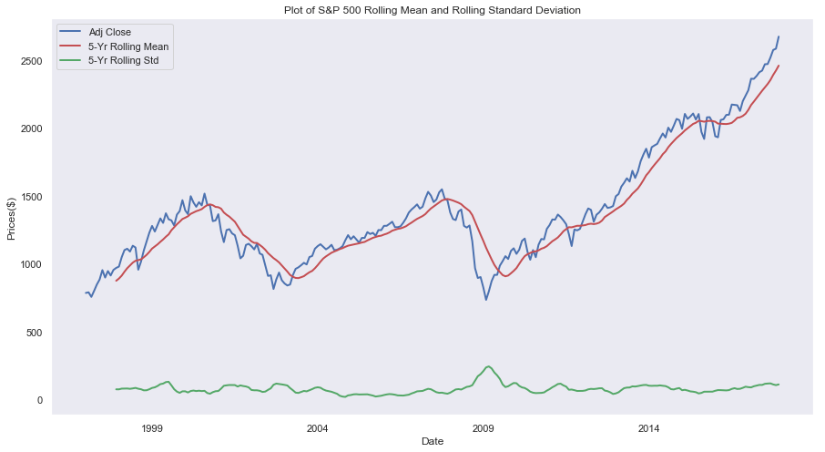
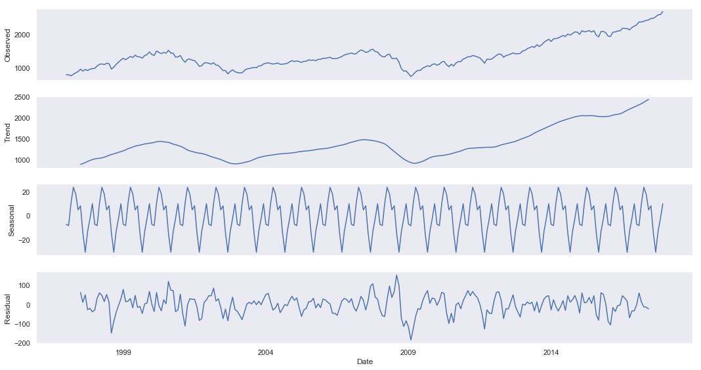
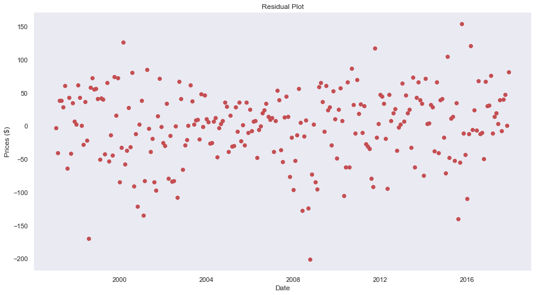

# Time Series Analysis of the S&P 500
#### Daphka Alius
#### 11 April 2019

Time series is a sequence of observations taken at discrete intervals in time. Time series analysis can be used to model data and is particularly useful in stock market analysis. The observations over a period of time can be mined for powerful insights that are useful in forecasting and predicting future observations. After a first introduction to the topic, I performed a time series analysis of the S&P 500 monthly dataset from January 1997 - December 2017 with a series of python libraries to forecast the 2018 monthly prices. In taking these steps, my goals were to gain a further understanding of the methodologies and build an intuition for how to interpret the results. I will employ different python modules and libraries including Pandas, NumPy, and statsmodels to complete the analysis.

The data set for this analysis was collected from Yahoo Finance which provides historical data for the S&P 500. Although the time series will be for a 20-year from 1997- 2017, I downloaded data up to 2018 in order to compare the 2018 predictions to the actual 2018 prices. Yahoo finance provides the opening, low, and high, and adjusted closing prices for the stock at that given day. In addition, it provides the volume of stocks traded. I use the adjusted closing price in this procedure. The adjusted closing price of the index refers to the closing price of the stock amended to any corporate actions that may have influenced the stock price for that day. 

Here's a breakdown of the steps of this time series analysis:
1. Exploratory analysis to determine trend, seasonality, and noise
2. Test for stationarity
3. Estimate Model Parameters
4. Use ARIMA model to forecast the monthly returns of 2018

## Exploratory Analysis
Any time series analysis is based on the assumption that the observations have the following three components:

+ Trend - captures long-term changes
+ Seasonality - captures periodic variations in the data
+ Noise - random variation of the trend

Trend and seasonality are a great indicator of a property known as stationarity, A data is considered stationary if all the observations are from the same distribution. In other words, a time series is stationary if the mean, variance, and correlation are constant over time. Stationarity is an important property when building a model because most models do not account for the trend. If the time series is non-stationary, then it must be transformed to stationary.

One way to determine trend is to plot the variable and see if decreases or increases in the long run.

Based on this plot, it shows an increasing pattern over the 20 years period. However, there's a lot of variation in the observations. A statistical tool, known as a *rolling mean* can be used to smoothen out the short-term fluctuations in the data in order to highlight long-term trends. Here I use a window of 12 months, which means that the function selects on a rolling basis a 12 month interval to calculate the mean. I've also calculated the rolling standard deviation to see if there's any volatility.

The result of the rolling mean smoothens some of the volatility of the stock market and visibly depict an upward trend that confirms the increasing pattern of the S&P500 Index. Additionally, the rolling standard deviation shows some variation in standard deviation. Knowing these two patterns, we can safely say that the data is non-stationary.

In addition to using this method to determine stationary, there are two additional ways  determine stationarity if your plot is ambiguous. 

### Seasonal Decompose
Statsmodels provide a method called **seasonal_decompose** which breaks down your time series into its three components.

This method returns three plots for trend, seasonality, and noise. From the plot above, it is clear that there's an increasing **trend**.  There seems to be some **seasonality** which was not obvious from just plotting the data. These tools both graphically and statistically provided a preliminary test of stationary using basic tools. However, there is an even more robust test of stationarity called the Augmented Dickey-Fuller Test which can be also be accessed via statsmodels time series analysis tools.

### Augmented Dickey-Fuller Test for Stationarity
In simple terms, the Augmented Dickey-Fuller Test for Stationarity is a statistical test known as a unit root test. A unit root test defines how strongly a time series is defined by its trend. The null hypothesis is that a time series can be represented by a unit root, which would imply that the time series is non-stationary.  The alternate hypothesis is the negation - that it is stationary. The more negative the ADF statistics the more that it supports the null hypothesis. Similarly, if we find a large p-value from this test, then we can determine that our variable is non-stationary and a smaller p-value would indicate stationary.

Here's a summary of the ADF test:
+ ADF Statistics: 0.8076504166249344
+ p-value: 0.9917586617863505
+ Critical value (1%): -3.4566744514553016
+ Critical value (5%): -2.8731248767783426
+ Critical value (10%): -2.5729436702592023

Given such a high p-value, the result suggests that it is highly likely that this time series does have a unit root which confirms that the time series is data indeed non-stationary.
Therefore, I will need to transform it to stationary in order to estimate the parameters of the forecasting model.

## Estimating Model Parameters
In order to build a model to forecast future prices, it is crucial to know how much to transform and adjust the time series in order to make it stationary. I use statsmodels to plot auto-correlation to show the changes between the autocorrelation of the data before and after the transformation. 

### Autocorrelation Function (ACF)
Time Series data have the property that the observations are ordered which means that past values can help us predict future values based on the correlation between each observations. The Autocorrelation Function (ACF) plots the coefficients of correlation between a time series and a shifted version of itself. In simpler terms, the *ACF* provides insights on how points in the data are correlated separated by a specific lag time. A **lag** is an interval used to calculate the correlation. For example, when lag = 1, we are calculating the correlation between values at *t=0* with *t=1*, *t=1* and *t=2*, *...*, and *t=n-1* and *t=n*.

Statsmodels provides a function called **plot_acf** which plots the autocorrelation function of the data set using lag = 40 and alpha = 0.05, which means that it returns cone signaling the 95% confidence interval.

As is expected, the autocorrelation is not constant since the data is not stationary.

### Transforming Data into Stationary by Taking the Differences
In order to transform the time series to stationary, I employ statsmodels *diff* function using a lag of order 1 (d = 1) by default, which means that it computes the autocorrelation of *ti* with *ti+1* for *i* up to *n* where *n* is the number of observations in the time series.

[acf plt](images/transformed_acf.png)

The ADF statistics based on this transformation are as followed:
+ ADF Statistics: -15.155031303806982
+ p-value: 6.7134196574358405e-28
+ Critical value (1%): -3.456780859712
+ Critical value (5%): -2.8731715065600003
+ Critical value (10%): -2.572968544

Note that the value of the ADF test is strongly negative and the p-value is significantly smaller than before which means the data has been transformed from non-stationary to stationary. Now we will employ the ARIMA model to forecast the 2018 adjusted prices.

## Using the ARIMA model to Forecast the Monthly Prices of 2018

### What is ARIMA?
ARIMA stands for **A**utoregressive **I**ntegrated **M**oving **A**verage.

Autoregression p**- refers to the dependent relationship between an observation and some number of lagged observations
Integrated *d*- refers to the difference of the raw observations (i.e transforming observations to make time series stationary)
Moving Average *q* - uses the dependency between an observation and residual errors from a moving average model applied to lagged observations

These three components are the parameters  used to create the model. statsmodels provides an ARIMA function which creates the model with the parameters *p, d, q*. To create a model for the S&P 500 data, I use the parameter p = 1, d = 1, and q = 0 . I estimate p = 1 because the data is highly correlated to itself as was seen from the ACF plot and d = 1 since it was sufficient to transform the data from non-stationary to stationary.

### Forecast
The ARIMA object from statsmodels includes a *fit* method which fits the model and allow the use of the forecast method to predict the 12 values. 

| Date          | Expected      | Forecast     |
| ------------- |:-------------:| ------------:|
| 2018-01-01    | $2823.810059  | $2683.870430 |
| 2018-02-01    | $2713.830078  | $2691.492655 |
| 2018-03-01    | $2640.870117  | $2699.026234 |
| 2018-04-01    | $2648.050049  | $2706.556834 |
| 2018-05-01    | $2705.270020  | $2714.087333 |
| 2018-06-01    | $2718.370117  | $2721.617830 |
| 2018-07-01    | $2816.290039  | $2729.148326 |
| 2018-08-01    | $2901.520020  | $2736.678823 |
| 2018-09-01    | $2913.979980  | $2744.209319 |
| 2018-10-01    | $2711.739990  | $2751.739815 |
| 2018-11-01    | $2760.169922  | $2759.270312 |
| 2018-12-01    | $2506.850098  | $2766.800808 |

The fit result also has a *resid* method which returns the residual of each observation and the prediction of the model.

The plot shows the residuals with a mean of 0 clustering around the horizontal axis for the most part which means that the model was potentially a good fit. Another calculation for how well the model fit the data is the root mean squared error. It can be interpreted as the standard deviation of the unexplained variance and is expressed in the same terms as the dependent variable. In this case the root mean error of the actual 2018 monthly values is approximately $13,3111. Evaluating the plot including the actual prices and the forecasted prices, there's a high deviation between the two segments. There are many factors that could have impacted the actual prices that caused this deviation including political and economic factors that the model does not consider. However, it's worth considering performing this analysis with a different set of parameters and see if there's a better fit.

## Conclusion
In performing this time series analysis, I've become familiar with the tools and packages in Python that can facilitate a full analysis and predictions. I've summarized a few of the fundamental and technical ways of performing exploratory analysis that test for stationarity as well as creating an ARIMA model that can forecast future observations. For further details on the methodologies, see this .
