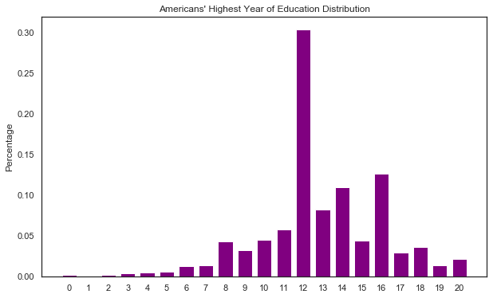
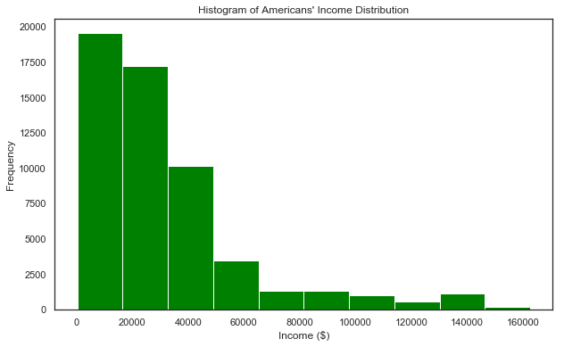
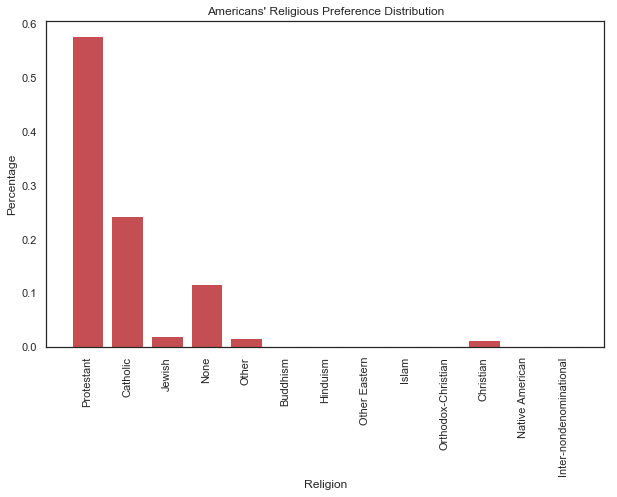
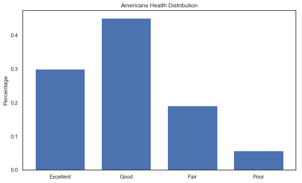
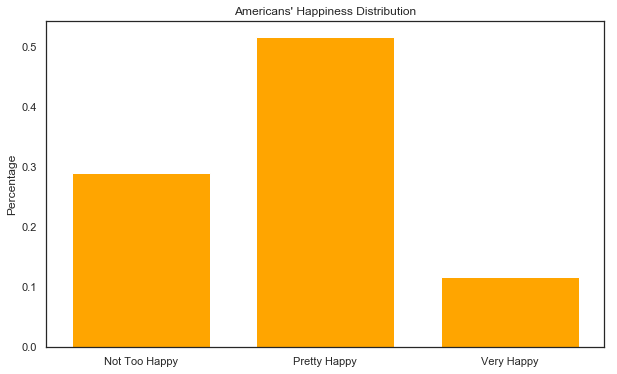
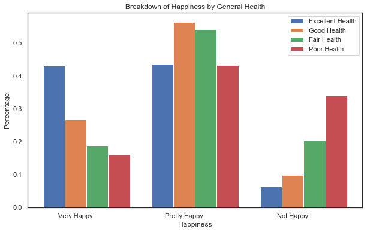

# Are Americans Happy? 
## What factors are associated with their happiness? 

Every two years, the United Nations (UN) publish a report on world happiness. This report ranks the happiness level of 156 countries and provide a score out of 10 for each counry. The 2018 report shows the Scandinavian countries like Finland, Norway, Denmark, and Iceland reigned the top ranks, in that respective order while the United States (US) ranked in the 18th position. Although Americans are ranked in the top 20 percent out of the 156 countries represented, which makes it relatively a happy country compared to the other nations. The UN has its own metrics to measure happiness, presumably GDP, [], etc. From a more personal level, there has been claimed that a person's happiness is determined by their genetics, accounting for 50 percent of their contentment. The other 50 percent is accounted for by circumstances and voluntary actions and activities. It is impossible to account for all of the factors that may influence a person's happiness; however, using a few circumstantial and voluntary factors like religion, income , education, health, we can ask if those factors are associated, if at all, with a person's happiness.

### General Social Survey (GSS)
The GSS is a national survey whose mission is to provide policymakers and academics an "unbiased and clear perspective" on how Americans think and feel about issues in their society. The survey's mission is "... [to gather] data on contemporary American society in order to monitor and explain trends and constants in attitudes, behaviors, and attributes." The GSS has been monitoring and explaining trends since 1972. The GSS provides respondents' responses to many surveyed questions. The survey provides information for 62,466 respondents over those period of time and 101 variables are reported in the dataset, and the variable of interest for the question posed are:
+ **realinc:** respondents' family income
+ **health:** respondents' responses to a question regarding their general health
+ **educ:** respondents' reported highest year of school completion
+ **relig:** respondents' religious preference/identification
+ **happy:*** respondents' responses to a question regarding their general happiness

#### Education

Given the 62,292 valid responses to highest year of school completion, majority of the respondents have at least completed high school. The most notable categories represents is 12 years, which is normally high school, with 30% of respondents, 14 years, which is equivalent to an Associate Degree or some college, with 10.9%, and lastly, 16 years, which is equivalent to a Bachelor Degree, with 12.6%.

#### Income

The breakdown of as can be seen with the histogram above, unimodal and right skewed with median of $24097 while the minimum income reported is $234 and the maximum is $162,607. The standard deviation of income is approximately $29,402. Out of the 56,141 respondents, 75% have reported to a family income of $39,022 or less.

#### Religion

Christianity, Judaism, and "other" accounts for majority of the religious preferences provided by respondents in the survey. They make up 86.8% of the responses while "None" represents 11.6% of the responses. When the variable was recoded to be a binary outcomes, out of the 62,197 respondents, 97% claims to have a religious preference while 3 percent claims to have none.

#### Health

Majority of the respondents responses show that they would describe their general health to be "good". When you combine those of excellent health and good health, we have all most an even division with those of fair or poor health.
#### Happiness

Based on the results of the World Happiness Report, the US scored 6.892 out of 10 and the highest ranking while the top ranked country Finland scored 7.632. Those numbers provide a scoring metrics that captures the countries growth, social support, life expectancy and much more. However, from the mouth of everyday Americans that participate in the GSS survey, about 63 percent would consider themselves at least pretty happy. 

It turns out that out of all the factors such as health, income, religion, education, health has a strong effects on happiness. Based on the results of the survey, it can be seen that a people who are of excellent would describe their general happiness as "very happy" at more than twice the rate than a person of poor health. On the other end of the spectrum, a person with poor health is over 5 times more likely to describe themselves as "not too happy" than those who are of excellent health. A person's general health can be impacted by genetics, making them prone to more illnesses and diseases. However, if one can reach at least fair health, they can experience a life that's pretty happy.

Additionally, the distribution of income between the three happiness levels show that people who consider themselves very happy had a mean income that was 5673.8 dollars higher than those who consider themselves pretty happy and 14,950 dollars higher than those who are not too happy. Education level does not appear to be as different among the three levels. All three groups were very close in terms of the average of the highest number of years of education completed. Those who were "very happy" or "pretty happy" had a mean of 13 years and those "not too happy" had a mean of 12 years.
